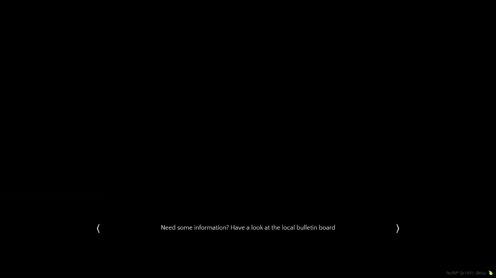

# twh_starttips
This script shows tips during the loading screen. Insert your custom loading screen tips in the `ui/scripts.js` file.

If the tips stay to long on the screen or disappear to soon, change the `waitTimer` in `client.lua`

# Example

